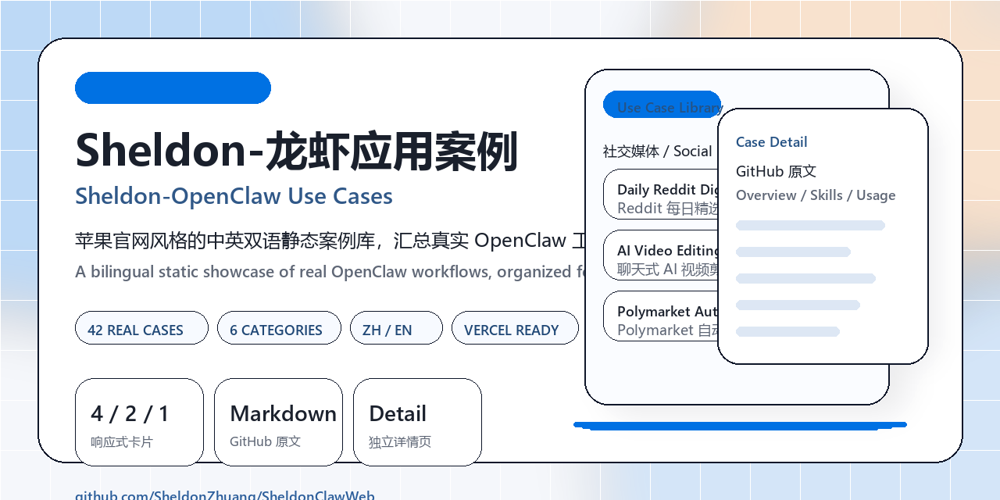

<div align="center">

# Sheldon-龙虾应用案例
### Sheldon-OpenClaw Use Cases

<p>
  <a href="https://sheldon-claw-web.vercel.app">Live Site</a> ·
  <a href="https://github.com/SheldonZhuang/SheldonClawWeb">GitHub Repo</a> ·
  <a href="https://github.com/hesamsheikh/awesome-openclaw-usecases">Upstream Data</a>
</p>

<p>
  
  
  
  
</p>



</div>

## 项目简介

Sheldon-龙虾应用案例 是一个苹果官网风格的中英文双语静态网站，用来汇总和展示真实的 OpenClaw 应用案例。站点按 6 大类别组织内容，支持响应式布局、首页卡片展开/收起交互，以及每个案例的独立详情页。详情页优先读取 GitHub 原始 Markdown，网络不可用时自动回退到本地缓存，并提供中文预翻译摘要，方便快速理解与复用。

## Overview

Sheldon-OpenClaw Use Cases is a bilingual static website inspired by Apple's visual style, built to organize and showcase real-world OpenClaw workflows. The site is grouped into six categories, includes responsive expandable cards on the homepage, and gives every use case a dedicated detail page. Each detail page prefers live GitHub Markdown, falls back to a local cache when needed, and includes a Chinese pre-translated summary for faster reading.

## Highlights

- 纯静态站点：HTML + CSS + JavaScript，无框架依赖
- 中英双语：中文为主，英文为辅，支持无刷新切换
- 真实案例库：当前整理 42 个 OpenClaw use cases
- 分类浏览：按社交媒体、创意与构建、基础设施与 DevOps、生产力工具、研究与学习、金融与交易 6 大类别组织
- 交互设计：桌面 4 列、平板 2 列、手机 1 列，支持卡片展开/收起
- 独立详情页：`case.html?id=...`
- GitHub 内容策略：优先拉取 upstream raw markdown，失败时回退本地缓存
- 部署友好：可直接部署到 Vercel

## Preview

- Live site: <https://sheldon-claw-web.vercel.app>
- GitHub repo: <https://github.com/SheldonZhuang/SheldonClawWeb>
- Upstream source data: <https://github.com/hesamsheikh/awesome-openclaw-usecases>

## Project Structure

```text
SheldonClawWeb/
├─ index.html
├─ case.html
├─ 404.html
├─ css/
├─ js/
├─ data/
│  ├─ cases.js
│  └─ source/usecases/
├─ scripts/
└─ vercel.json
```

## Data Pipeline

- Upstream README and `usecases/*.md` are cached under `data/source/`
- `scripts/generate-cases.mjs` converts upstream content into frontend-ready data
- `scripts/case-overrides.mjs` stores curated Chinese titles and summaries
- `data/cases.js` is the final static dataset consumed by the site

## Local Development

```bash
python -m http.server 4173
```

Then open:

```text
http://127.0.0.1:4173
```

## Deployment

This project is designed for direct static deployment on Vercel.

```bash
vercel --prod
```

## Social Preview

The repository preview asset is included at:

```text
assets/github-preview.png
```

If you want GitHub's repository social preview card to use the same image, upload this file manually in:

```text
GitHub Repo Settings -> Social preview
```
